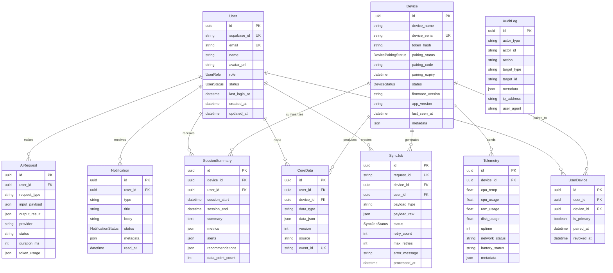

# 🌾 ARISA Cloud Backend

> **A**gricultural **R**eal-time **I**ntelligent **S**ystem **A**ssistant — Cloud Backend API

NestJS-based cloud backend for the ARISA hybrid IoT agricultural monitoring system. Provides authentication, device management, data synchronization, AI gateway, and admin capabilities.

**Production URL:** `https://arisa.biz.id`  
**Swagger Docs:** `https://arisa.biz.id/api/docs`  
**Health Check:** `https://arisa.biz.id/health`

---

## 📑 Table of Contents

- [Architecture Overview](#architecture-overview)
- [Tech Stack](#tech-stack)
- [Project Structure](#project-structure)
- [Getting Started](#getting-started)
- [Environment Variables](#environment-variables)
- [Database Schema](#database-schema)
- [API Reference](#api-reference)
  - [Health](#health-endpoints)
  - [Auth](#auth-endpoints)
  - [User](#user-endpoints)
  - [Device](#device-endpoints)
  - [Sync](#sync-endpoints)
  - [Data](#data-endpoints)
  - [Telemetry](#telemetry-endpoints)
  - [AI Gateway](#ai-gateway-endpoints)
  - [Notification](#notification-endpoints)
  - [Admin](#admin-endpoints)
- [Authentication & Security](#authentication--security)
- [Deployment](#deployment)
  - [Docker](#docker)
  - [Railway](#railway)
  - [Google Cloud Run](#google-cloud-run)
- [Flutter Mobile Integration](#flutter-mobile-integration)
- [Error Handling](#error-handling)
- [Rate Limiting](#rate-limiting)

---

## Architecture Overview

```
┌─────────────────┐     ┌──────────────────────────────────────────────┐
│  Flutter Mobile  │────▶│           ARISA Cloud Backend (NestJS)       │
│  App (ARISA)     │◀────│                                              │
└─────────────────┘     │  ┌────────┐ ┌────────┐ ┌──────────────────┐  │
                        │  │  Auth  │ │ Device │ │   AI Gateway     │  │
┌─────────────────┐     │  │ Module │ │ Module │ │ (OpenRouter)     │  │
│  Raspberry Pi   │────▶│  └────────┘ └────────┘ └──────────────────┘  │
│  (Edge Device)  │◀────│  ┌────────┐ ┌────────┐ ┌──────────────────┐  │
└─────────────────┘     │  │  Sync  │ │  Data  │ │   Admin Panel    │  │
                        │  │ Module │ │ Module │ │   Module         │  │
                        │  └────────┘ └────────┘ └──────────────────┘  │
                        └────────────────┬─────────────────────────────┘
                                         │
                    ┌────────────────────┼────────────────────┐
                    │                    │                    │
              ┌─────▼─────┐      ┌──────▼──────┐     ┌──────▼──────┐
              │ Supabase   │      │ PostgreSQL  │     │   Redis     │
              │   Auth     │      │  (Prisma)   │     │  (Optional) │
              └────────────┘      └─────────────┘     └─────────────┘
```

### Data Flow

1. **Mobile App → Cloud**: Flutter sends requests with JWT Bearer token
2. **Raspberry Pi → Cloud**: Edge device authenticates via `X-Device-Token` header
3. **Cloud → Supabase**: Auth operations (login, register) delegate to Supabase Auth
4. **Cloud → PostgreSQL**: All business data persisted via Prisma ORM
5. **Cloud → Redis**: Optional caching layer (graceful degradation if unavailable)
6. **Cloud → OpenRouter**: AI requests proxied through OpenRouter API

---

## Tech Stack

| Component | Technology | Version |
|---|---|---|
| **Runtime** | Node.js | 20 LTS (Alpine) |
| **Framework** | NestJS | 11.x |
| **Language** | TypeScript | 5.7+ |
| **ORM** | Prisma | 7.x (with `@prisma/adapter-pg`) |
| **Database** | PostgreSQL | 15 (via Supabase) |
| **Auth** | Supabase Auth | 2.x SDK |
| **Cache** | Redis (ioredis) | 7 Alpine (optional) |
| **AI Provider** | OpenRouter | REST API |
| **API Docs** | Swagger/OpenAPI | `@nestjs/swagger` 11.x |
| **Validation** | class-validator + Joi | — |
| **Security** | Helmet + bcrypt | — |
| **Container** | Docker | Multi-stage build |
| **Hosting** | Railway / Google Cloud Run | — |

---

## Project Structure

```
backend-arisa/
├── Dockerfile                  # Multi-stage production build
├── .dockerignore               # Docker build context exclusions
├── docker-compose.yml          # Local dev (Postgres + Redis)
├── package.json                # Dependencies & scripts
├── tsconfig.json               # TypeScript configuration
├── nest-cli.json               # NestJS CLI config
├── prisma.config.ts            # Prisma CLI config (direct URL for migrations)
│
├── prisma/
│   └── schema.prisma           # Database schema (10 models, 6 enums)
│
└── src/
    ├── main.ts                 # Application bootstrap & Swagger setup
    ├── app.module.ts           # Root module — imports all feature modules
    │
    ├── common/                 # Shared utilities
    │   ├── config/
    │   │   ├── configuration.ts       # Typed config mapping from env vars
    │   │   └── env.validation.ts      # Joi schema for env validation
    │   ├── constants/
    │   │   └── roles.ts               # UserRole enum mirror
    │   ├── decorators/
    │   │   ├── current-user.decorator.ts    # @CurrentUser() param decorator
    │   │   ├── current-device.decorator.ts  # @CurrentDevice() param decorator
    │   │   ├── public.decorator.ts          # @Public() route decorator
    │   │   └── roles.decorator.ts           # @Roles() route decorator
    │   ├── dto/
    │   │   └── pagination.dto.ts      # Reusable pagination DTO
    │   ├── filters/
    │   │   └── http-exception.filter.ts   # Global error formatter (bilingual)
    │   ├── guards/
    │   │   ├── jwt-auth.guard.ts      # Supabase JWT verification
    │   │   ├── device-auth.guard.ts   # X-Device-Token verification (bcrypt)
    │   │   └── roles.guard.ts         # RBAC guard (USER/ADMIN/SUPER_ADMIN)
    │   ├── interceptors/
    │   │   ├── transform.interceptor.ts   # Wraps all responses in { data, meta }
    │   │   └── logging.interceptor.ts     # Request/response logging
    │   ├── interfaces/
    │   │   ├── api-response.interface.ts        # Standard API response type
    │   │   └── authenticated-request.interface.ts  # Extended Express Request
    │   └── middleware/
    │       └── request-id.middleware.ts   # Adds X-Request-Id to every request
    │
    ├── prisma/                 # Database service
    │   ├── prisma.module.ts           # Global Prisma module
    │   └── prisma.service.ts          # PrismaClient wrapper (pg Pool adapter)
    │
    ├── redis/                  # Cache service
    │   ├── redis.module.ts            # Global Redis module
    │   └── redis.service.ts           # Redis wrapper (graceful fallback)
    │
    ├── supabase/               # Auth provider
    │   ├── supabase.module.ts         # Global Supabase module
    │   └── supabase.service.ts        # Supabase client (anon + service role)
    │
    └── modules/                # Feature modules
        ├── health/             # Liveness + readiness probes
        ├── auth/               # Register, login, OAuth, refresh, logout
        ├── user/               # Profile CRUD
        ├── device/             # Device registration, pairing, heartbeat
        ├── sync/               # Edge↔Cloud data sync (push/pull/batch/ack)
        ├── data/               # Core business data CRUD
        ├── telemetry/          # Device telemetry (CPU, RAM, sensors)
        ├── audit/              # Audit log service
        ├── notification/       # In-app notifications
        ├── ai-gateway/         # AI chat, analyze, vision, streaming SSE
        └── admin/              # Admin dashboard & device management
```

---

## Getting Started

### Prerequisites

- **Node.js** 20+ 
- **npm** 10+
- **Docker** (optional, for local Postgres + Redis)

### Installation

```bash
# Clone the repository
git clone https://github.com/ThiefRiefMarhas/arisabackend.git
cd arisabackend

# Install dependencies
npm install

# Copy environment template
cp .env.example .env
# Edit .env with your Supabase, database, and OpenRouter credentials

# Generate Prisma Client
npx prisma generate

# Push schema to database (first time only)
npx prisma db push

# Start development server
npm run start:dev
```

### Available Scripts

| Script | Description |
|---|---|
| `npm run start` | Start in production mode |
| `npm run start:dev` | Start in dev mode (hot reload) |
| `npm run start:debug` | Start in debug mode |
| `npm run start:prod` | Start compiled JS (`node dist/main`) |
| `npm run build` | Build TypeScript → `dist/` |
| `npm run lint` | Lint with ESLint |
| `npm run format` | Format with Prettier |
| `npm test` | Run Jest unit tests |
| `npm run test:e2e` | Run end-to-end tests |

### Local Docker Setup

```bash
# Start Postgres + Redis containers
docker compose up -d

# Verify services
docker compose ps

# Stop services
docker compose down
```

This gives you:
- **PostgreSQL** at `localhost:5432` (user: `arisa`, password: `arisa_dev_password`, db: `arisa`)
- **Redis** at `localhost:6379`

---

## Environment Variables

All environment variables and their validation rules:

| Variable | Required | Default | Description |
|---|---|---|---|
| **Application** | | | |
| `PORT` | No | `3000` | Server port (Cloud Run injects `8080`) |
| `NODE_ENV` | No | `development` | `development` / `production` / `test` |
| **Supabase** | | | |
| `SUPABASE_URL` | ✅ Yes | — | Supabase project URL |
| `SUPABASE_ANON_KEY` | ✅ Yes | — | Supabase anonymous/public key |
| `SUPABASE_SERVICE_ROLE_KEY` | ✅ Yes | — | Supabase service role key (admin) |
| `SUPABASE_JWT_SECRET` | ✅ Yes | — | JWT secret for token verification |
| **Database** | | | |
| `DATABASE_URL` | ✅ Yes | — | PostgreSQL connection string (pooler, port 6543) |
| `DIRECT_URL` | No | — | Direct connection for Prisma migrations (port 5432) |
| **Redis** | | | |
| `REDIS_HOST` | No | `localhost` | Redis hostname |
| `REDIS_PORT` | No | `6379` | Redis port |
| `REDIS_PASSWORD` | No | ` ` | Redis password (empty = no auth) |
| **Security** | | | |
| `DEVICE_REGISTRATION_SECRET` | ✅ Yes (min 20 chars) | — | Shared secret for Pi device registration |
| `DEVICE_TOKEN_SALT_ROUNDS` | No | `12` | bcrypt salt rounds for device tokens |
| `PAIRING_CODE_EXPIRY_MINUTES` | No | `10` | How long pairing codes remain valid |
| **Rate Limiting** | | | |
| `THROTTLE_TTL` | No | `60` | Window size in seconds |
| `THROTTLE_LIMIT` | No | `100` | Max requests per window |
| **OpenRouter AI** | | | |
| `OPENROUTER_API_KEY` | ✅ Yes | — | OpenRouter API key |
| `OPENROUTER_DEFAULT_MODEL` | No | `google/gemini-3.5-flash` | Primary AI model |
| `OPENROUTER_FALLBACK_MODEL` | No | `anthropic/claude-haiku-4.5` | Fallback when primary fails |
| `OPENROUTER_MAX_TOKENS` | No | `8192` | Max response tokens |
| `OPENROUTER_TIMEOUT_MS` | No | `30000` | Request timeout (ms) |
| `AI_USER_RATE_LIMIT_PER_MINUTE` | No | `10` | AI requests per user per minute |
| `AI_USER_RATE_LIMIT_PER_HOUR` | No | `100` | AI requests per user per hour |

---

## Database Schema

### Entity Relationship Diagram



### Enums

| Enum | Values |
|---|---|
| `UserRole` | `SUPER_ADMIN`, `ADMIN`, `USER` |
| `UserStatus` | `ACTIVE`, `SUSPENDED`, `DELETED` |
| `DevicePairingStatus` | `UNPAIRED`, `PAIRING`, `PAIRED`, `REVOKED` |
| `DeviceStatus` | `ACTIVE`, `DISABLED`, `DECOMMISSIONED` |
| `SyncJobStatus` | `PENDING`, `QUEUED`, `PROCESSING`, `SYNCED`, `FAILED`, `CONFLICT` |
| `NotificationStatus` | `UNREAD`, `READ`, `ARCHIVED` |

### Key Indexes

| Table | Index | Columns |
|---|---|---|
| `sync_jobs` | Status lookup | `(device_id, status)` |
| `sync_jobs` | User timeline | `(user_id, created_at)` |
| `sync_jobs` | Processing queue | `(status, created_at)` |
| `core_data` | User data query | `(user_id, data_type, created_at)` |
| `core_data` | Device data query | `(device_id, created_at)` |
| `telemetry` | Device timeline | `(device_id, created_at)` |
| `audit_logs` | Actor query | `(actor_id, created_at)` |
| `audit_logs` | Action query | `(action, created_at)` |
| `audit_logs` | Target query | `(target_type, target_id, created_at)` |
| `notifications` | User inbox | `(user_id, status, created_at)` |
| `ai_requests` | User history | `(user_id, created_at)` |
| `session_summaries` | User view | `(user_id, created_at)` |
| `session_summaries` | Device view | `(device_id, session_start)` |

---

## API Reference

**Base URL:** `https://arisa.biz.id/api/v1`  
**Swagger UI:** `https://arisa.biz.id/api/docs`

### Standard Response Format

All responses are wrapped by `TransformInterceptor`:

```json
{
  "statusCode": 200,
  "data": { ... },
  "meta": {
    "requestId": "uuid-v4",
    "timestamp": "2026-06-05T02:00:00.000Z"
  }
}
```

Error responses:

```json
{
  "statusCode": 401,
  "error": {
    "code": "UNAUTHORIZED",
    "message": "Email atau kata sandi yang Anda masukkan salah.",
    "userMessage": "Periksa kembali email dan kata sandi Anda."
  },
  "meta": {
    "requestId": "uuid-v4",
    "timestamp": "2026-06-05T02:00:00.000Z"
  }
}
```

---

### Health Endpoints

> No authentication required. Not prefixed with `/api/v1`.

| Method | Path | Description |
|---|---|---|
| `GET` | `/health` | Liveness probe — returns `{ status: "ok", uptime }` |
| `GET` | `/ready` | Readiness probe — checks DB, Redis, Supabase connectivity |

---

### Auth Endpoints

| Method | Path | Auth | Description |
|---|---|---|---|
| `POST` | `/auth/register` | 🔓 Public | Register new user (email + password + name) |
| `POST` | `/auth/login` | 🔓 Public | Login with email + password |
| `POST` | `/auth/oauth/google` | 🔓 Public | Login/register with Google OAuth ID token |
| `POST` | `/auth/refresh` | 🔓 Public | Refresh access token using refresh token |
| `POST` | `/auth/forgot-password` | 🔓 Public | Send password reset link to email |
| `POST` | `/auth/logout` | 🔒 JWT | Invalidate current session |
| `POST` | `/auth/revoke-all` | 🔒 JWT | Revoke all sessions for user |

#### Register Request

```json
POST /api/v1/auth/register
{
  "email": "petani@example.com",
  "password": "password123",
  "name": "Budi Hartono"
}
```

#### Login Response

```json
{
  "statusCode": 200,
  "data": {
    "accessToken": "eyJhbGciOi...",
    "refreshToken": "v1.abc123...",
    "expiresIn": 3600,
    "user": {
      "id": "uuid",
      "email": "petani@example.com",
      "name": "Budi Hartono",
      "role": "USER"
    }
  }
}
```

---

### User Endpoints

| Method | Path | Auth | Description |
|---|---|---|---|
| `GET` | `/user/profile` | 🔒 JWT | Get current user profile |
| `PATCH` | `/user/profile` | 🔒 JWT | Update profile (name, avatarUrl) |

---

### Device Endpoints

| Method | Path | Auth | Description |
|---|---|---|---|
| `POST` | `/devices/register` | 🔓 Public (+ secret) | Register new Raspberry Pi device |
| `POST` | `/devices/pair/start` | 🔒 JWT | Generate pairing code for a device |
| `POST` | `/devices/pair/confirm` | 🔒 JWT | Confirm pairing — bind device to user |
| `GET` | `/devices` | 🔒 JWT | List all devices for current user |
| `GET` | `/devices/:id` | 🔒 JWT | Get device detail (ownership check) |
| `POST` | `/devices/:id/revoke` | 🔒 JWT | Unpair device from user |
| `POST` | `/devices/:id/heartbeat` | 🔑 Device Token | Send heartbeat from Pi |

#### Device Registration (called by Pi on first boot)

```json
POST /api/v1/devices/register
{
  "deviceName": "ARISA-Pi-001",
  "deviceSerial": "RPI-2026-ABC123",
  "registrationSecret": "your-shared-secret"
}
```

#### Pairing Flow

```
1. Pi boots → POST /devices/register → receives deviceToken
2. User (mobile) → POST /devices/pair/start { deviceId } → receives pairingCode
3. User enters code → POST /devices/pair/confirm { deviceSerial, pairingCode }
4. Device is now PAIRED to user
```

---

### Sync Endpoints

> All sync endpoints require Device Token authentication (`X-Device-Token` header).

| Method | Path | Auth | Description |
|---|---|---|---|
| `POST` | `/sync/push` | 🔑 Device Token | Push single sync item |
| `POST` | `/sync/batch` | 🔑 Device Token | Push batch (max 100 items) |
| `GET` | `/sync/status/:jobId` | 🔑 Device Token | Check sync job status |
| `POST` | `/sync/ack` | 🔑 Device Token | Acknowledge synced items |
| `GET` | `/sync/pull?since=&limit=` | 🔑 Device Token | Pull updates from cloud |

#### Sync Push Request

```json
POST /api/v1/sync/push
X-Device-Token: device_abc123...

{
  "requestId": "uuid-v4-idempotency-key",
  "payloadType": "sensor_reading",
  "userId": "user-uuid",
  "payloadRaw": {
    "temperature": 28.5,
    "humidity": 75.2,
    "soilMoisture": 42.1,
    "timestamp": "2026-06-05T02:00:00Z"
  }
}
```

---

### Data Endpoints

| Method | Path | Auth | Description |
|---|---|---|---|
| `POST` | `/data` | 🔒 JWT | Create core data entry |
| `GET` | `/data?type=&page=&limit=` | 🔒 JWT | List data (filtered, paginated) |
| `GET` | `/data/:id` | 🔒 JWT | Get single data entry |
| `PATCH` | `/data/:id` | 🔒 JWT | Update data entry |
| `DELETE` | `/data/:id` | 🔒 JWT | Soft-delete data entry |

---

### Telemetry Endpoints

| Method | Path | Auth | Description |
|---|---|---|---|
| `POST` | `/telemetry` | 🔑 Device Token | Push device telemetry |
| `GET` | `/telemetry/:deviceId?since=&limit=` | 🔒 JWT | Get telemetry history |

#### Telemetry Push

```json
POST /api/v1/telemetry
X-Device-Token: device_abc123...

{
  "deviceId": "device-uuid",
  "cpuTemp": 52.3,
  "cpuUsage": 35.0,
  "ramUsage": 62.1,
  "diskUsage": 45.0,
  "uptime": 86400,
  "networkStatus": "connected",
  "batteryStatus": "powered",
  "metadata": {
    "wifiSignal": -45,
    "localIp": "192.168.1.100"
  }
}
```

---

### AI Gateway Endpoints

| Method | Path | Auth | Description |
|---|---|---|---|
| `POST` | `/ai/chat` | 🔒 JWT | Chat with AI (non-streaming) |
| `POST` | `/ai/chat/stream` | 🔒 JWT | Chat with AI (SSE streaming) |
| `POST` | `/ai/analyze` | 🔒 JWT | Structured analysis (plant disease, soil) |
| `POST` | `/ai/vision` | 🔒 JWT | Image analysis via AI vision |
| `GET` | `/ai/history?page=&limit=` | 🔒 JWT | Get AI request history |
| `GET` | `/ai/usage` | 🔒 JWT | Get token/cost usage summary |
| `GET` | `/ai/credits` | 🔒 Admin | Check OpenRouter API balance |
| `GET` | `/ai/models` | 🔒 JWT | List available AI models |

#### AI Chat Request

```json
POST /api/v1/ai/chat
Authorization: Bearer eyJhbGciOi...

{
  "message": "Tanaman padi saya menguning di ujung daun, kira-kira kenapa?",
  "conversationHistory": [
    { "role": "user", "content": "..." },
    { "role": "assistant", "content": "..." }
  ],
  "webSearch": true,
  "model": "google/gemini-3.5-flash"
}
```

#### AI Streaming (SSE)

```
POST /api/v1/ai/chat/stream

Response: text/event-stream
data: {"type":"content","content":"Tanaman padi"}
data: {"type":"content","content":" yang menguning"}
data: {"type":"content","content":" di ujung daun..."}
data: {"type":"usage","usage":{"promptTokens":150,"completionTokens":89,"totalTokens":239}}
data: [DONE]
```

---

### Notification Endpoints

| Method | Path | Auth | Description |
|---|---|---|---|
| `GET` | `/notifications?status=&page=&limit=` | 🔒 JWT | List notifications |
| `POST` | `/notifications/:id/read` | 🔒 JWT | Mark notification as read |

---

### Admin Endpoints

> All admin endpoints require `ADMIN` or `SUPER_ADMIN` role.

| Method | Path | Auth | Description |
|---|---|---|---|
| `GET` | `/admin/dashboard` | 🔒 Admin | Dashboard stats (users, devices, sync jobs) |
| `GET` | `/admin/users?page=&limit=` | 🔒 Admin | List all users |
| `GET` | `/admin/devices?page=&limit=` | 🔒 Admin | List all devices |
| `GET` | `/admin/sync-jobs?status=&page=&limit=` | 🔒 Admin | List sync jobs |
| `GET` | `/admin/logs?action=&actorType=` | 🔒 Admin | Query audit logs |
| `POST` | `/admin/devices/:id/disable` | 🔒 Admin | Disable a device |

---

## Authentication & Security

### Dual Authentication System

| Consumer | Mechanism | Header | Guard |
|---|---|---|---|
| **Mobile App** (User) | Supabase JWT | `Authorization: Bearer <jwt>` | `JwtAuthGuard` |
| **Raspberry Pi** (Device) | Hashed token (bcrypt) | `X-Device-Token: <token>` | `DeviceAuthGuard` |

### JWT Verification Flow

```
1. Mobile sends: Authorization: Bearer <supabase-jwt>
2. JwtAuthGuard extracts token
3. Verifies JWT signature using SUPABASE_JWT_SECRET
4. Looks up User in DB by supabase_id
5. Attaches user to request.user
6. RolesGuard checks user.role if @Roles() is present
```

### Device Token Verification Flow

```
1. Pi sends: X-Device-Token: <raw-token>
2. DeviceAuthGuard extracts token
3. Finds device by ID in URL
4. Compares raw token with stored bcrypt hash
5. Attaches device to request.device
```

### Security Features

- **Helmet** — HTTP security headers
- **CORS** — Configurable cross-origin policy
- **Rate Limiting** — `@nestjs/throttler` (configurable TTL/limit)
- **Input Validation** — `class-validator` with `whitelist: true` + `forbidNonWhitelisted: true`
- **bcrypt** — Device token hashing (12 rounds default)
- **Request ID** — Every request gets a unique `X-Request-Id`
- **Audit Log** — All critical actions logged with actor, target, IP, user-agent

---

## Deployment

### Docker

Build and run locally:

```bash
# Build image
docker build -t arisa-backend .

# Run with env file
docker run --rm -p 3000:3000 --env-file .env arisa-backend

# Test health
curl http://localhost:3000/health
```

### Railway

Already deployed and working. Railway auto-detects the Dockerfile.

### Google Cloud Run

The Dockerfile is optimized for Cloud Run:

- **Multi-stage build** — minimal production image (~150MB)
- **Non-root user** — `arisa` user for security
- **`0.0.0.0` binding** — required by Cloud Run
- **`PORT` env var** — Cloud Run injects this automatically
- **Health check** — `/health` endpoint for liveness probes

Deploy via `gcloud`:

```bash
# Build & deploy in one command
gcloud run deploy arisa-backend \
  --source . \
  --region asia-southeast1 \
  --allow-unauthenticated \
  --set-env-vars="NODE_ENV=production" \
  --set-env-vars="SUPABASE_URL=..." \
  --set-env-vars="SUPABASE_ANON_KEY=..." \
  --set-env-vars="SUPABASE_SERVICE_ROLE_KEY=..." \
  --set-env-vars="SUPABASE_JWT_SECRET=..." \
  --set-env-vars="DATABASE_URL=..." \
  --set-env-vars="OPENROUTER_API_KEY=..." \
  --set-env-vars="DEVICE_REGISTRATION_SECRET=..."
```

Or connect GitHub for auto-deploy via CI/CD.

---

## Flutter Mobile Integration

The Flutter app connects to this backend via:

```dart
// lib/core/constants/api_constants.dart
class ApiConstants {
  static const String baseUrl = 'https://arisa.biz.id/api/v1';
  
  // Auth
  static const String login      = '/auth/login';
  static const String register   = '/auth/register';
  static const String refresh    = '/auth/refresh';
  static const String logout     = '/auth/logout';
  static const String forgotPassword = '/auth/forgot-password';
  
  // User
  static const String userProfile = '/user/profile';
  
  // Device
  static const String devices          = '/devices';
  static const String devicePairStart  = '/devices/pair/start';
  static const String devicePairConfirm = '/devices/pair/confirm';
  
  // Health
  static const String health = '/health';
}
```

### Token Management

```
1. Login → Store accessToken + refreshToken in SharedPreferences
2. Every API call → Attach "Authorization: Bearer <accessToken>"
3. On 401 → Auto-refresh using refreshToken → Retry original request
4. On refresh failure → Redirect to login screen
```

---

## Error Handling

### Global Exception Filter

The `HttpExceptionFilter` returns bilingual error messages optimized for Indonesian farmers:

| HTTP Status | Error Code | User Message (ID) |
|---|---|---|
| `400` | `BAD_REQUEST` | Data yang Anda kirim tidak sesuai format |
| `401` | `UNAUTHORIZED` | Email atau kata sandi yang Anda masukkan salah |
| `403` | `FORBIDDEN` | Akun Anda tidak memiliki izin untuk akses ini |
| `404` | `NOT_FOUND` | Data yang Anda cari tidak ditemukan |
| `409` | `CONFLICT` | Email ini sudah terdaftar |
| `422` | `UNPROCESSABLE` | Data belum lengkap, periksa kembali isian |
| `429` | `TOO_MANY_REQUESTS` | Terlalu banyak percobaan, tunggu beberapa menit |
| `500` | `INTERNAL_ERROR` | Sistem sedang dalam perbaikan sementara |

---

## Rate Limiting

| Scope | Limit | Window |
|---|---|---|
| **Global** | 100 requests | 60 seconds |
| **AI per user** (per minute) | 10 requests | 60 seconds |
| **AI per user** (per hour) | 100 requests | 3600 seconds |

---

## License

UNLICENSED — Private project for ARISA agricultural IoT system.

---

<p align="center">
  Built with ❤️ for Indonesian farmers<br>
  <strong>ARISA</strong> — Smart Rice Monitoring System
</p>
